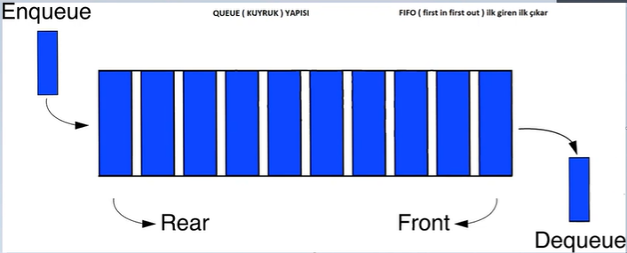

### TANIMLAMALAR
````java
   private final int [] queue;//Queue için dizi oluşturulmuştur
   private final int size;//Dizinin boyutu
   private final int front;//en öndeki eleman
   private int back;//en son elemanını ve eleman miktarını tutan kuyruk (eleman eklenirse kuyruk olması için)
````
### ENQUEUE
````java
 if (isFull())
            System.out.println("Kuyruk yapısı dolu");
        else
        {
            this.back++;//ilk elemandan itibaren 0 dan başlanarak arttırma yapılır
            queue[back]=data;//sayacın her artan değeri dizinin o değerine atanır
        }
````
### DEQUEUE
````java
if (isEmpty())
            System.out.println("Kuyruk yapısı boş");
        else
        {
            int sayi=queue[front];//çıkarılan sayı gösterilip silineceği için bir değişkene atanır
            for (int i = 1; i<= back; i++)
                queue[i-1]=queue[i];// eleman çıkarıldığı için her elaman bir öne alınır

            System.out.println("En öndeki  eleman: "+sayi);
            this.back--;//eleman sayısı azaltılır

        }
````