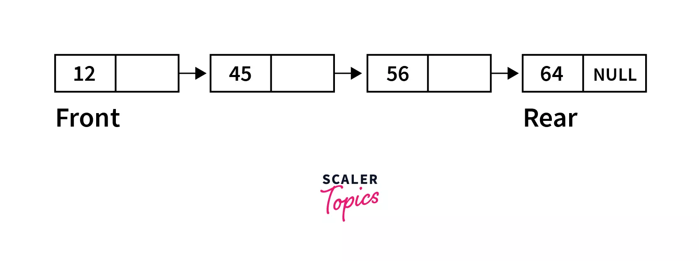
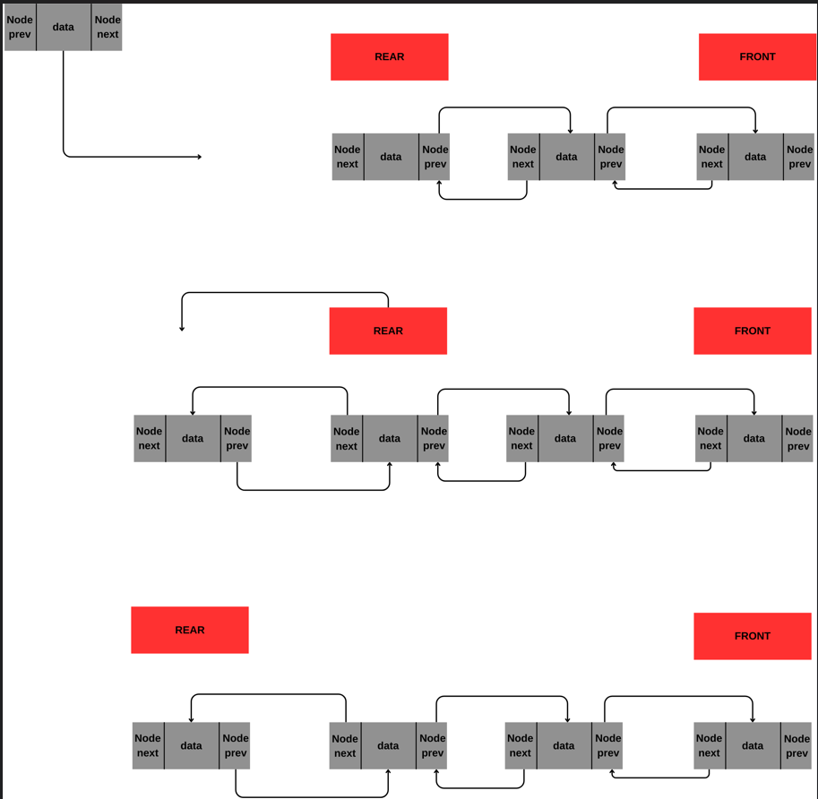
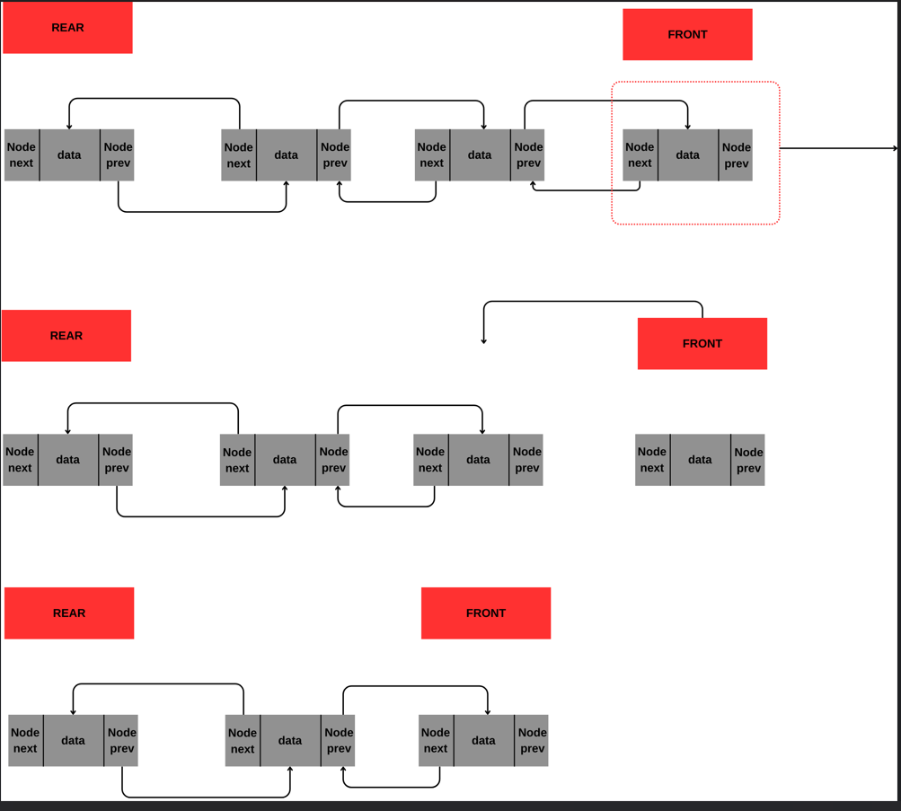

### Enqueue

````java
System.out.println("Lütfen bir eleman giriniz: ");
            int value=input.nextInt();

            QueueNode queueNode=new QueueNode(value);

            if (top ==null)//Eğer top boşsa ilk eleman gelen değerdir ve en arkada en önde bu elemandır
            {
                setTop(queueNode);
                setBack(queueNode);
            }
            else
            {
                getBack().setNext(queueNode);//En arkadaki elemanın bir arkası yeni gelen eleman olarak atanır
                queueNode.setPrev(back);//Kuyruk mantığına uyarak kendisinden önce gelen bir önündekidir (okul sırası)
                setBack(queueNode);// En son gelen en arka yani kuyruk olur
            }
            counter++;//Kuyruktaki eleman sayısı bir arttı

            System.out.println("Eleman eklendi: "+value);
````


### Dequeue

````java

if (isEmpty())
            System.out.println("Kuyrukta eleman yok..");
        else
        {
            System.out.println("Kuyruğa ilk giren eleman: "+ top.getData());
            setTop(getTop().getNext());//Eleman çıktığına göre bir sonraki en öndeki olan çıkanın bir arkasındakidir
            if (counter>1)
                getTop().setPrev(null);//En öne gelen elemanın önünde kimse olmadığından önü boş ayarlanır
            counter--;
        }
````

