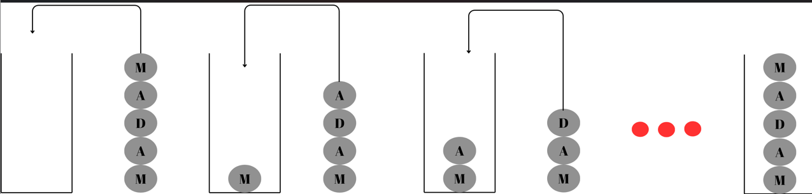
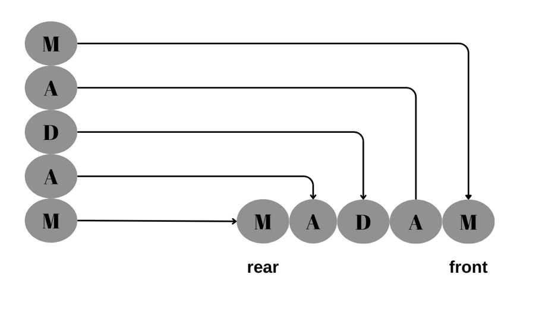
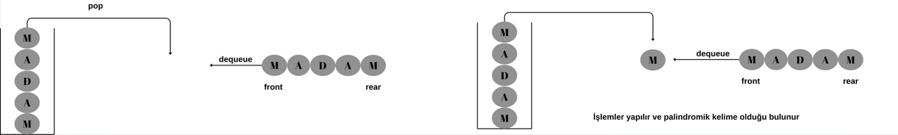

## STACK VE QUEUE İLE PALİNDORMİK KONTROL

### KELİMENİN STACK'E EKLENMESİ




````java

if (isFull())
            System.out.println("Stack yapısı doldu");

        else
        {
            Node wordChar=new Node(c);//Her char için bir node üretilir

            if (top != null)//Stack boş değilse ;
                wordChar.setNext(top);//gelen elemanın nexti bir öncekini gösterir

            top=wordChar;//gelen eleman en yığıtın en üstüne gönderilir
            counter++;//yığıttaki eleman sayısını ölçen sayaç arttırılır
        }
````

### KELİMENİN QUEUE'YA EKLENMESİ



````java
if (isFull())
         System.out.println("Kuyruk yapısı dolu");
      else
      {
         Node wordChar=new Node(c);//Her karaktere bir node oluşturulur

         if (front==null)//Hiç eleman yokse
            front=wordChar;//gelen eleman en öne eklenir

         rear.setNext(wordChar);//gelen eleman kuyruğun bir sonraki elemanı olarak ayarlanır
         rear=wordChar;//bir sonraki elemanı olarak ayarlandıktan sonra kendisi kuyruk olur
         counter++;
      }
````

### Palindromik kontrolün sağlanması


````java
 //Kelime hem stack hem queue'ya gönderilir
        for (int i=0;i<size;i++)
        {
            stack.push(charArray[i]);
            queue.enQueue(charArray[i]);
        }

        boolean result=true;

        while (!stack.isEmpty())
        {
            if (stack.pop()!=queue.deQueue())//herhangi bir harf eşit değilse palindromik değildir
            {
                result=false;
                break;
            }
        }

        if(result)
            System.out.println("Palindromik kelime girdiniz..");
        else
            System.out.println("Girdiğiniz kelime palindromik değildir");
````